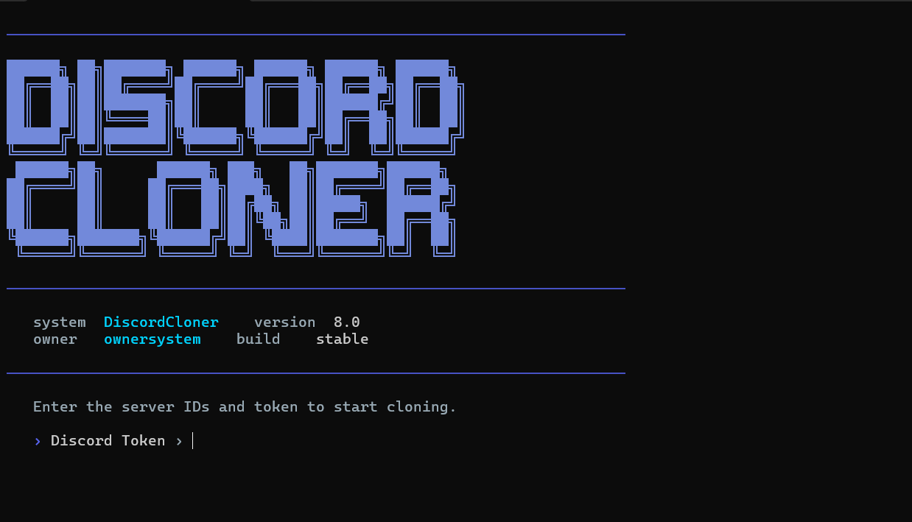

<div align="center">

# DiscordCloner v8

**A console tool for fully cloning the structure of a Discord server**

[🇷🇺 Русская версия](./README.ru.md) · [⬅ Back to main](./README.md)

[](./RELEASE_NOTES.md)
[](https://nodejs.org)
[](https://www.typescriptlang.org/)
[](./README.md)



</div>

---

## Table of Contents

- [About](#about)
- [Features](#features)
- [Installation](#installation)
- [Running](#running)
- [Usage](#usage)
- [Requirements](#requirements)
- [Warning](#warning)
- [Disclaimer](#disclaimer)

---

## About

**DiscordCloner** is a console CLI tool that transfers the structure of one Discord server onto another: roles with all their settings, channels and categories with permission overwrites, emojis, stickers, and the server's name, icon, and banner.

The tool is built around resilient Discord API error handling — when channel creation fails (for example, because of invalid characters in the name or a deprecated voice region), it automatically falls back to a sensible retry instead of halting the whole process.

<div align="center">

</div>

---

## Features

- 🎭 **Full role cloning** — names, colors, permissions, hierarchy positions
- 🗂 **Channel and category cloning** — with permission overwrites and preserved structure
- 🛡 **Resilient channel creation** — on a `400 Bad Request` from the Discord API, the tool retries with a normalized name and, if needed, with emojis and special characters stripped
- 🎙 **Voice region validation** — channel `rtc_region` is checked against Discord's current region list; invalid or deprecated values are simply dropped instead of failing the request
- 😀 **Emoji and sticker cloning** — respects the target server's boost limits
- 🖼 **Server branding copy** — name, icon, and banner
- ⚙️ **Flexible clone modes**:
  - Full clone (roles + channels + settings)
  - Emojis and stickers only
  - Roles only (with or without permissions/positions)
- 🪵 **Clear error logging** — the report includes the actual reason returned by the Discord API, not a generic error code
- 🌍 **Russian and English interface** — language selection on the very first screen, before the token prompt
- 📄 **Saved reports** — the results of every clone are written to a log file

---

## Installation

```bash
git clone <repository url>
cd DiscordCloner
npm install
```

## Running

Development mode (no build step):

```bash
npm run dev
```

Or build and run the compiled version:

```bash
npm run build
npm start
```

---

## Usage

1. On first launch, pick the interface language (🇷🇺 Русский / 🇬🇧 English).
2. Enter your Discord token.
3. Provide the **source server ID** (to clone from) and the **target server ID** (to clone into).
4. Pick a clone mode and follow the on-screen prompts.

---

## Requirements

- **Node.js** 18 or newer
- An account or bot token with the necessary permissions on both servers

---

## Warning

> ⚠️ **A full clone deletes all existing channels and roles on the target server.** This action is irreversible. Only use this tool on servers you're authorized to modify.

---

## Disclaimer

- This project is **not affiliated with, endorsed by, or sponsored by Discord Inc.** in any way. "Discord" is a trademark of Discord Inc.
- Using this tool, especially with a user account token instead of a bot token, **may violate Discord's [Terms of Service](https://discord.com/terms) and [Community Guidelines](https://discord.com/guidelines)**, including restrictions on automating client features (self-botting). Violating Discord's ToS can result in account or server termination by Discord.
- The author(s) provide this tool **"as is", without warranty of any kind**, express or implied, including but not limited to warranties of merchantability, fitness for a particular purpose, and non-infringement.
- The author(s) **shall not be held liable** for any direct, indirect, incidental, or other damages, including account bans, loss of server data, or any other consequences arising from the use or inability to use this software.
- Full responsibility for using this tool, and for complying with applicable law and the terms of any platform it is used on, rests **solely with the user**.

---

<div align="center">

[🇷🇺 Русская версия](./README.ru.md) · [⬅ Back to main](./README.md)

</div>
