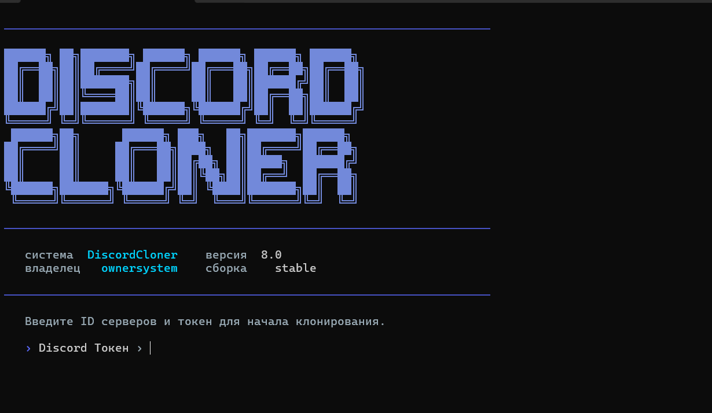

<div align="center">

# DiscordCloner v8

**Консольный инструмент для полного клонирования структуры Discord-сервера**

[🇬🇧 English version](./README.en.md) · [⬅ На главную](./README.md)

[](./RELEASE_NOTES.md)
[](https://nodejs.org)
[](https://www.typescriptlang.org/)
[](./README.md)



</div>

---

## Содержание

- [О проекте](#о-проекте)
- [Возможности](#возможности)
- [Установка](#установка)
- [Запуск](#запуск)
- [Использование](#использование)
- [Требования](#требования)
- [Предупреждение](#предупреждение)

---

## О проекте

**DiscordCloner** — это консольный CLI-инструмент, который переносит структуру одного Discord-сервера на другой: роли со всеми настройками, каналы и категории с правами доступа, эмодзи, стикеры, а также название, аватарку и баннер сервера.

Инструмент построен на надёжной обработке ошибок Discord API — при отказе создания канала (например, из-за недопустимых символов в названии или устаревшего голосового региона) выполняется автоматический разумный откат, а не остановка всего процесса.

<div align="center">

</div>

---

## Возможности

- 🎭 **Полное клонирование ролей** — имена, цвета, разрешения, позиции в иерархии
- 🗂 **Клонирование каналов и категорий** — с правами доступа и сохранением структуры
- 🛡 **Устойчивое создание каналов** — при `400 Bad Request` от Discord API выполняется повтор с нормализованным названием, а при необходимости — без эмодзи и спецсимволов
- 🎙 **Проверка голосовых регионов** — `rtc_region` каналов сверяется с актуальным списком регионов Discord; недопустимые или устаревшие значения просто отбрасываются вместо падения запроса
- 😀 **Клонирование эмодзи и стикеров** — с учётом буст-лимитов целевого сервера
- 🖼 **Копирование оформления сервера** — название, аватарка, баннер
- ⚙️ **Гибкие режимы работы**:
  - Полное клонирование (роли + каналы + настройки)
  - Только эмодзи и стикеры
  - Только роли (с разрешениями и позициями или без)
- 🪵 **Понятный лог ошибок** — в отчёт попадает реальная причина отказа от Discord API, а не общий код ошибки
- 🌍 **Русский и английский интерфейс** — выбор языка на первом экране, до ввода токена
- 📄 **Сохранение отчёта** — итоги каждого клонирования пишутся в лог-файл

---

## Установка

```bash
git clone <ссылка на репозиторий>
cd DiscordCloner
npm install
```

## Запуск

Режим разработки (без сборки):

```bash
npm run dev
```

Или сборка и запуск скомпилированной версии:

```bash
npm run build
npm start
```

---

## Использование

1. При первом запуске выберите язык интерфейса (🇷🇺 Русский / 🇬🇧 English).
2. Введите Discord-токен.
3. Укажите **ID исходного сервера** (с которого клонировать) и **ID целевого сервера** (куда клонировать).
4. Выберите режим клонирования и следуйте подсказкам на экране.

---

## Требования

- **Node.js** 18 или новее
- Токен аккаунта или бота с необходимыми правами на обоих серверах

---

## Предупреждение

> ⚠️ **Полное клонирование удаляет все существующие каналы и роли на целевом сервере.** Это действие необратимо. Используйте инструмент только на серверах, где у вас есть право вносить такие изменения.

---

<div align="center">

[🇬🇧 English version](./README.en.md) · [⬅ На главную](./README.md)

</div>
